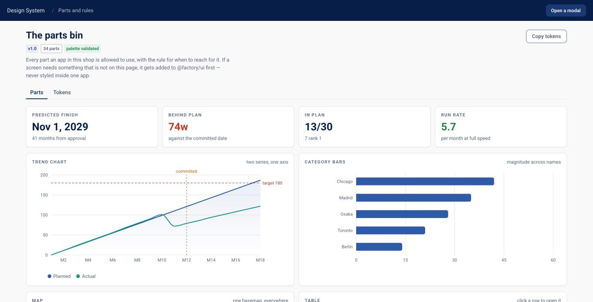

# Software Factory

**An enterprise UI skin plus the build method that keeps agents inside it.**

Coding agents are very good at building an app and very bad at building the
*same* app twice. Ask for three internal tools and you get three design
languages: one with pill buttons, one with a purple gradient, one with a
14-step colour ramp nobody chose. The code works. The estate looks like it was
assembled from three different companies.

This repo fixes that the way a factory does. There is one parts bin, one set of
rules, and an instruction sheet the agent has to follow. Describe an app, and
what comes back looks like everything else you have shipped — even when it is a
rough prototype, even when someone else's agent built it.



## What is in the box

```
packages/ui/        The skin. Tokens, 113 parts and 14 recipes. The only place styling lives.
apps/_template/     What a new app starts as.
apps/gallery/       The living style guide: every part and recipe, by archetype.
apps/…              One folder per app built here.
docs/               The contract: principles, archetypes, parts catalogue, data, checklist.
skill/              The instruction sheet an agent follows.
```

Screens ship under a placeholder wordmark, ACME. Swap it for yours with a
single prop.

The skin is deliberately plain: a restrained navy-and-grey enterprise look,
13px base type, dense tables, flat cards. It is built for working tools that
sit next to a spreadsheet, not for a marketing site. Swap it for your own brand
in about ten minutes — see [docs/SKINNING.md](docs/SKINNING.md).

## Try it

```bash
npm install
npm run gallery      # every part → http://localhost:8821
npm run dev --workspace @factory/contract-renewals   # a real app → http://localhost:8822
```

`contract-renewals` is a worked example: a book of vendor contracts, a builder
screen where flipping a call redraws the totals and the curve live, and a
detail page. Every pixel of it comes from the parts bin. No CSS was written for
it.

## Use it with an agent

The skill in `skill/` is written for [Claude
Code](https://claude.com/claude-code), and reads fine to any agent that can
follow a Markdown brief.

```bash
git clone https://github.com/<you>/software-factory ~/Projects/software-factory
ln -s ~/Projects/software-factory/skill ~/.claude/skills/software-factory
```

Then ask, in plain words:

> Build me an app that tracks which vendor contracts to renew. Run it through
> the software factory.

The agent copies the template, picks parts, wires real data, and walks
`docs/CHECKLIST.md` before claiming it works.

## The eight archetypes

Almost every internal tool is one of eight shapes of work. Naming the shape
first is what stops an app being invented from scratch — pick the archetype,
start from its recipe, swap the sample data for yours.

| Archetype | The person is | Start from |
|---|---|---|
| Monitor & alert | checking whether anything needs them today | `DashboardPage` |
| Review & disposition | working a list one record at a time | `ReviewQueuePage` |
| Scenario workbench | changing an assumption and watching it redraw | `ComparePage` |
| Plan & schedule | putting dated work on a timeline | `SchedulePage` |
| Reconcile & attribute | choosing which system to believe | `ReconcilePage` |
| Approve & route | holding the pen on somebody else's work | `ApprovalInboxPage` |
| Track & follow up | keeping a pile of open work moving | `BoardPage` |
| Report & readout | reading the sheet, not using the tool | `ReportPage` |

Each one has its own tab in the gallery, its own checklist addendum, and a
recipe that renders live with sample data. See
[docs/ARCHETYPES.md](docs/ARCHETYPES.md).

## The three rules that do the work

1. **No hex codes in an app.** Colour comes from tokens and Tailwind classes.
2. **No new component in an app.** A missing part gets added to `packages/ui`,
   documented in `docs/PARTS.md`, and shown in the gallery. Every app then
   gets it for free.
3. **No restyling a part.** Nudging spacing is fine. Changing a colour, height
   or border is not.

Everything else follows from those. `docs/PRINCIPLES.md` has the behavioural
rules, `docs/CONTRACTS.md` is what several agents building in parallel agree
on, `docs/TONE.md` is the six-word state vocabulary, `docs/DATA.md` is the
seven cross-cutting models every app starts with, and `docs/CHECKLIST.md` is
what "done" means.

## Design decisions worth knowing

- **Next.js 14 + Tailwind + TypeScript.** Boring on purpose. Any agent already
  knows it.
- **The package owns the whole CSS pipeline** — an app's `globals.css` is a
  single import, so there is nowhere to quietly redefine a control.
- **The chart palette is validated, not eyeballed.** Six categorical colours,
  checked for lightness banding, chroma, contrast, and colour-blind separation.
  Re-run the check if you change one.
- **Charts go through wrappers**, never Recharts directly. That is what keeps
  grid weight, axis colour and tooltips identical everywhere. There is no
  dual-axis option, deliberately.
- **Animation is off on chart marks.** Under React 18 they sometimes never
  paint, and a chart that is occasionally blank is worse than a still one.

## Licence

MIT. Take it, re-skin it, ship it.
